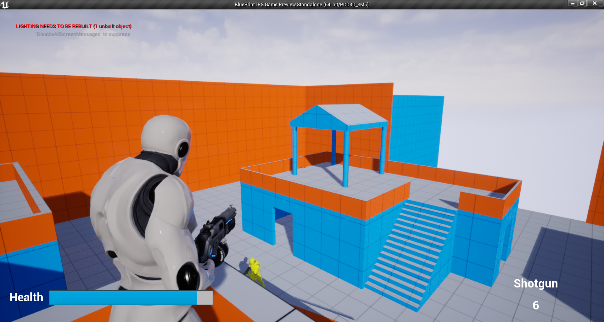

# Third-Person-Shooter
(WIP) A third person shooter made with Unreal Engine 4. ~~All scripts are written in Blueprints.~~ This project originally contained only Blueprints. However, since some functions cannot be seen and overridden in Blueprints, and I may need to improve performance in the future, I had to convert the project into a C++ project.
This project requires Unreal Engine 4.22. If you want to upgrade the project to the latest version of Unreal Engine 4, you may have to change the source code.

TODO:
  + AI:
    - Make the NPCs alert when they get hurt by a projectile, or when an enemy touches them.
    - Prevent the NPCs from shooting at walls.
  + Decal:
    - Fix the bullet holes not apprearing on a character when it is shot.
  + Gameplay:
    - Create blueprints for doors, moving platforms, and launchpads.
  + Animation:
    - Improve melee animation.
  + Input:
    - Fix the mouse input not working properly in the standalone game.

Third-party assets and plugins:
   + Animation Starter Pack (https://www.unrealengine.com/marketplace/en-US/product/animation-starter-pack)
   + Sci Fi Weapons Silver (https://www.unrealengine.com/marketplace/en-US/product/sci-fi-weapons-silver?sessionInvalidated=true)
   + Tom Looman's Grid Material (https://www.tomlooman.com/updated-mockup-material-for-unreal-4/)
   + Advanced Sessions Plugin (https://forums.unrealengine.com/t/advanced-sessions-plugin/30020)

